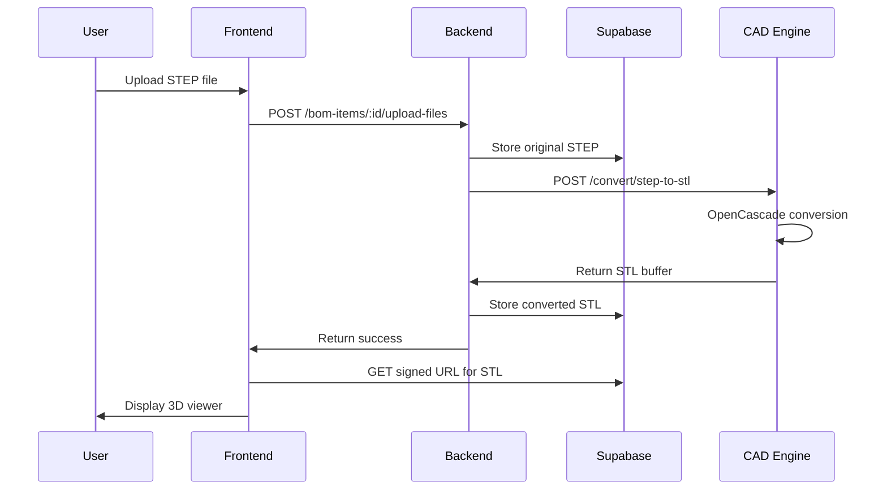

# CAD Engine Setup and Deployment Guide

Complete guide for deploying the professional STEP to STL conversion infrastructure.

## Architecture Overview

```
User Upload (STEP) → Next.js Frontend → NestJS Backend → Python CAD Engine (OpenCascade) → STL Output
                                                ↓
                                          Supabase Storage
                                          - Original STEP (archived)
                                          - Converted STL (for viewing)
```

## Technology Stack

- **Python CAD Engine**: FastAPI + pythonocc-core (OpenCascade)
- **NestJS Backend**: HTTP proxy to CAD engine + Supabase integration
- **Next.js Frontend**: 3D viewer with React Three Fiber
- **Storage**: Supabase Storage with RLS policies

## Development Setup

### Prerequisites

- Node.js 18+
- Python 3.11+
- Docker (optional, recommended)

### Option 1: Docker Deployment (Recommended)

**1. Start all services with docker-compose:**

```bash
# From project root
docker-compose up --build
```

This starts:
- **CAD Engine** on `http://localhost:5000`
- **Backend API** on `http://localhost:4000`
- **Frontend** on `http://localhost:3000`

**2. Verify CAD engine health:**

```bash
curl http://localhost:5000/health
```

Expected response:
```json
{
  "status": "healthy",
  "opencascade": "pythonocc-core 7.7.2",
  "capabilities": ["STEP", "IGES", "STL"]
}
```

### Option 2: Local Development

**1. Start Python CAD Engine:**

```bash
cd cad-engine
pip install -r requirements.txt
python main.py
# Server runs on http://localhost:5000
```

**2. Configure Backend:**

Add to `backend/.env`:
```env
CAD_ENGINE_URL=http://localhost:5000
```

**3. Start Backend:**

```bash
cd backend
npm install
npm run start:dev
# Server runs on http://localhost:4000
```

**4. Start Frontend:**

```bash
npm install
npm run dev
# Server runs on http://localhost:3000
```

## Environment Configuration

### Backend (.env)

```env
# Supabase
NEXT_PUBLIC_SUPABASE_URL=https://your-project.supabase.co
NEXT_PUBLIC_SUPABASE_ANON_KEY=your-anon-key
SUPABASE_SERVICE_KEY=your-service-role-key

# CAD Engine
CAD_ENGINE_URL=http://localhost:5000  # Or http://cad-engine:5000 in Docker

# Server
PORT=4000
NODE_ENV=development
CORS_ORIGIN=http://localhost:3000
```

### Production Deployment

**Docker Production:**

```bash
# Build optimized images
docker-compose -f docker-compose.yml -f docker-compose.prod.yml up -d

# Scale CAD engine for high load
docker-compose up -d --scale cad-engine=3
```

**Environment variables for production:**

```env
CAD_ENGINE_URL=http://cad-engine:5000  # Internal Docker network
NODE_ENV=production
CORS_ORIGIN=https://yourdomain.com
```

## Testing the CAD Pipeline

### 1. Test CAD Engine Directly

**Upload a STEP file:**

```bash
curl -X POST http://localhost:5000/convert/step-to-stl \
  -F "file=@/path/to/cone_clutch.stp" \
  -o output.stl
```

**Check file size:**

```bash
ls -lh output.stl
# Should show converted STL file
```

### 2. Test via Backend API

**Upload via NestJS:**

```bash
# Get auth token from Supabase first
TOKEN="your-jwt-token"

# Upload STEP file to BOM item
curl -X POST http://localhost:4000/api/v1/bom-items/{item-id}/upload-files \
  -H "Authorization: Bearer $TOKEN" \
  -F "file3d=@cone_clutch.stp"
```

### 3. Test Full Frontend Flow

1. Go to `http://localhost:3000`
2. Navigate to a project → BOM
3. Create or edit a BOM item
4. Upload a STEP file (cone_clutch.stp)
5. Wait for conversion (~5-30 seconds depending on file size)
6. View the item details - should show interactive 3D viewer with STL

## File Upload Flow



## Troubleshooting

### CAD Engine Not Available

**Error:** "CAD Engine not available - STEP files will be download-only"

**Solutions:**
1. Check if CAD engine is running: `curl http://localhost:5000/health`
2. Verify `CAD_ENGINE_URL` in backend .env
3. Check Docker logs: `docker-compose logs cad-engine`
4. Restart services: `docker-compose restart cad-engine`

### Conversion Fails

**Error:** "STEP to STL conversion failed"

**Possible causes:**
1. **Invalid STEP file** - Verify with FreeCAD or another CAD tool
2. **File too large** - Check timeout settings (default 60s)
3. **Memory issues** - Complex assemblies need more RAM
4. **Corrupted geometry** - Some STEP files have invalid B-Rep data

**Debug steps:**
```bash
# Check CAD engine logs
docker-compose logs cad-engine

# Test conversion directly
curl -X POST http://localhost:5000/convert/step-to-stl \
  -F "file=@problem-file.step" \
  -v
```

### STL File Not Displaying

**Check:**
1. File uploaded successfully (check Supabase Storage)
2. Signed URL generated correctly
3. Browser console for Three.js errors
4. File extension is `.stl` (should auto-convert)

## Performance Tuning

### CAD Engine Settings

Edit `cad-engine/main.py`:

```python
# For higher quality meshes (larger files, slower)
converter = StepConverter(
    linear_deflection=0.05,  # Default: 0.1
    angular_deflection=0.3    # Default: 0.5
)

# For faster conversion (lower quality, smaller files)
converter = StepConverter(
    linear_deflection=0.2,
    angular_deflection=0.8
)
```

### Scaling Considerations

**For high-volume deployments:**

1. **Multiple CAD engine instances:**
   ```bash
   docker-compose up -d --scale cad-engine=5
   ```

2. **Add load balancer** (nginx):
   ```nginx
   upstream cad-engine {
       server cad-engine:5000;
       # Multiple instances auto-balanced by Docker
   }
   ```

3. **Increase timeouts** for large files:
   ```typescript
   // backend/src/modules/bom-items/services/step-converter.service.ts
   timeout: 120000, // 2 minutes
   ```

4. **Queue system** for async processing (Redis + Bull)

## Monitoring

### Health Checks

**CAD Engine:**
```bash
curl http://localhost:5000/health
```

**Backend:**
```bash
curl http://localhost:4000/health
```

### Logs

**Docker:**
```bash
# All services
docker-compose logs -f

# Specific service
docker-compose logs -f cad-engine
```

**Local development:**
- CAD Engine: stdout (INFO level)
- Backend: NestJS logger
- Frontend: Browser console + Next.js terminal

## Supported File Formats

### Input (CAD):
- `.step`, `.stp` - STEP AP203/AP214 (ISO 10303)
- `.iges`, `.igs` - IGES 5.x (legacy)

### Output (Mesh):
- `.stl` - Binary STL (optimized)

### Direct Viewing (No Conversion):
- `.stl` - STL files (already mesh format)
- `.obj` - Wavefront OBJ files

## Security Considerations

1. **File size limits** - Default 100MB (configurable)
2. **Timeout protection** - 60s default conversion timeout
3. **Input validation** - File extension and MIME type checks
4. **Temp file cleanup** - Automatic cleanup after conversion
5. **RLS policies** - Supabase Row Level Security for file access

## Professional Standards

This implementation follows industry best practices:

- ✅ **ISO 10303 compliant** - Standard STEP file parsing
- ✅ **Production CAD kernel** - OpenCascade (used by CATIA, FreeCAD)
- ✅ **Microservice architecture** - Scalable and maintainable
- ✅ **Error handling** - Graceful degradation if conversion unavailable
- ✅ **Logging** - Comprehensive audit trail
- ✅ **Type safety** - Full TypeScript + Python type hints
- ✅ **API documentation** - OpenAPI/Swagger specs
- ✅ **Container support** - Production-ready Docker setup

## Next Steps

1. **Test with your STEP files** - Upload `cone_clutch.stp`
2. **Monitor performance** - Check conversion times
3. **Adjust mesh quality** - Balance quality vs file size
4. **Scale as needed** - Add more CAD engine instances
5. **Set up monitoring** - Prometheus + Grafana (optional)

## Support

For issues or questions:
- Check logs: `docker-compose logs cad-engine`
- Verify health: `curl http://localhost:5000/health`
- Review backend logs: Check NestJS console
- Test conversion directly: Use curl commands above
